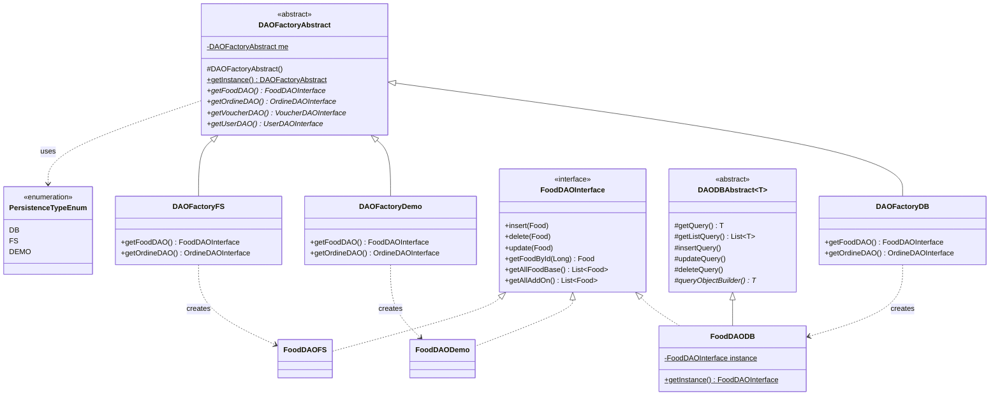

# Analisi Tecnica Approfondita: Architettura DAO con Abstract Factory Pattern

## Abstract

Il presente documento fornisce un'analisi accademica approfondita dell'architettura di persistenza dei dati implementata nel progetto "Habibi Shawarma". L'architettura adotta il **Data Access Object (DAO) Pattern** in combinazione con l'**Abstract Factory Pattern** (GoF), implementando un sistema modulare e configurabile che supporta tre modalità di persistenza: Database Relazionale (H2), File System (CSV), e modalità Demo (in-memory).

---

## 1. Introduzione e Contesto Architetturale

### 1.1 Problema di Dominio

In un'applicazione enterprise, la gestione della persistenza dei dati rappresenta una sfida progettuale significativa. I requisiti tipici includono:

- **Disaccoppiamento** tra logica di business e meccanismo di persistenza
- **Intercambiabilità** delle tecnologie di storage
- **Testabilità** attraverso implementazioni mock
- **Configurabilità** a runtime senza ricompilazione

### 1.2 Soluzione Architetturale Adottata

L'architettura implementata combina strategicamente tre Design Pattern GoF:

| Pattern | Ruolo | Classe/i Coinvolta/e |
|---------|-------|---------------------|
| **Abstract Factory** | Creazione famiglie di DAO | `DAOFactoryAbstract`, `DAOFactoryDB`, `DAOFactoryDemo`, `DAOFactoryFS` |
| **Singleton** | Istanza unica factory e DAO | `DAOFactoryAbstract.me`, `*DAODB.instance` |
| **Template Method** | Algoritmi CRUD riutilizzabili | `DAODBAbstract<T>` |

---

## 2. Design Pattern: Abstract Factory (GoF)

### 2.1 Definizione Formale (Gang of Four)

> *"Provide an interface for creating families of related or dependent objects without specifying their concrete classes."*
>
> — Gamma, Helm, Johnson, Vlissides (1994)

### 2.2 Struttura del Pattern nel Progetto

```
┌─────────────────────────────────────────────────────────────────────────┐
│                         CLIENT CODE                                      │
│                  (Controller, Facade, Use Cases)                        │
└───────────────────────────────┬─────────────────────────────────────────┘
                                │ richiede
                                ▼
┌─────────────────────────────────────────────────────────────────────────┐
│                      DAOFactoryAbstract                                 │
│                       <<abstract class>>                                │
│  ┌────────────────────────────────────────────────────────────────────┐ │
│  │  - me: DAOFactoryAbstract [static]                                 │ │
│  ├────────────────────────────────────────────────────────────────────┤ │
│  │  + getInstance(): DAOFactoryAbstract [static, synchronized]        │ │
│  │  + getFoodDAO(): FoodDAOInterface [abstract]                       │ │
│  │  + getOrdineDAO(): OrdineDAOInterface [abstract]                   │ │
│  │  + getVoucherDAO(): VoucherDAOInterface [abstract]                 │ │
│  │  + getUserDAO(): UserDAOInterface [abstract]                       │ │
│  │  + getClienteDAO(): ClienteDAOInterface [abstract]                 │ │
│  │  + getKebabbaroDAO(): KebabbaroDAOInterface [abstract]             │ │
│  │  + getAmministratoreDAO(): AmministratoreDAOInterface [abstract]   │ │
│  └────────────────────────────────────────────────────────────────────┘ │
└───────────────────────────────┬─────────────────────────────────────────┘
                                │ extends
        ┌───────────────────────┼───────────────────────┐
        ▼                       ▼                       ▼
┌───────────────┐       ┌───────────────┐       ┌───────────────┐
│ DAOFactoryDB  │       │DAOFactoryDemo │       │ DAOFactoryFS  │
│               │       │               │       │               │
│ Persistence:  │       │ Persistence:  │       │ Persistence:  │
│ H2 Database   │       │ In-Memory     │       │ CSV Files     │
└───────────────┘       └───────────────┘       └───────────────┘
        │                       │                       │
        │ creates               │ creates               │ creates
        ▼                       ▼                       ▼
┌───────────────┐       ┌───────────────┐       ┌───────────────┐
│  *DAODB       │       │  *DAODemo     │       │  *DAOFS       │
│  (Singleton)  │       │  (Prototype)  │       │  (Singleton)  │
└───────────────┘       └───────────────┘       └───────────────┘
```

### 2.3 Analisi del Codice Sorgente

#### 2.3.1 Abstract Factory: `DAOFactoryAbstract`

```java
public abstract class DAOFactoryAbstract {

    private static DAOFactoryAbstract me = null;  // Singleton holder

    protected DAOFactoryAbstract() {
        // Costruttore protected: impedisce istanziazione diretta
    }

    public static synchronized DAOFactoryAbstract getInstance() 
            throws ResourceNotFoundException, PropertyException {
        if (me == null) {
            // Strategy Selection basata su configurazione esterna
            PersistenceTypeEnum persistenceType = PersistenceTypeEnum
                .getPersistenceTypeByValue(
                    PropertiesHandler.getInstance().getProperty("persistence_type")
                );
            
            if (persistenceType != null)
                switch (persistenceType) {
                    case DB   -> me = new DAOFactoryDB();
                    case DEMO -> me = new DAOFactoryDemo();
                    case FS   -> me = new DAOFactoryFS();
                    default   -> throw new PropertyException(...);
                }
            else
                throw new ResourceNotFoundException(...);
        }
        return me;
    }

    // Factory Methods astratti - definiscono l'interfaccia del prodotto
    public abstract FoodDAOInterface getFoodDAO();
    public abstract OrdineDAOInterface getOrdineDAO();
    public abstract VoucherDAOInterface getVoucherDAO();
    public abstract UserDAOInterface getUserDAO();
    public abstract ClienteDAOInterface getClienteDAO();
    public abstract KebabbaroDAOInterface getKebabbaroDAO();
    public abstract AmministratoreDAOInterface getAmministratoreDAO();
}
```

**Analisi Tecnica:**

| Aspetto | Implementazione | Beneficio |
|---------|-----------------|-----------|
| **Singleton** | `private static me` + `synchronized getInstance()` | Thread-safety, istanza unica globale |
| **Lazy Initialization** | Creazione in `getInstance()` se `me == null` | Risparmio risorse, fail-fast |
| **Protected Constructor** | `protected DAOFactoryAbstract()` | Impedisce `new DAOFactoryAbstract()` |
| **Configuration-driven** | Lettura da `PropertiesHandler` | Cambio persistenza senza ricompilazione |
| **Switch Expression** | Java 14+ enhanced switch | Codice più conciso e type-safe |

#### 2.3.2 Concrete Factory: `DAOFactoryDB`

```java
public class DAOFactoryDB extends DAOFactoryAbstract {

    @Override
    public FoodDAOInterface getFoodDAO() {
        return FoodDAODB.getInstance();  // Singleton retrieval
    }

    @Override
    public OrdineDAOInterface getOrdineDAO() {
        return OrdineDAODB.getInstance();
    }

    @Override
    public VoucherDAOInterface getVoucherDAO() {
        return VoucherDAODB.getInstance();
    }

    @Override
    public UserDAOInterface getUserDAO() {
        return UserDAODB.getInstance();
    }
    
    // ... altri metodi factory
}
```

**Nota Implementativa:** Ogni metodo factory restituisce un Singleton del DAO specifico per database, garantendo:
- Riutilizzo delle connessioni
- Stato condiviso (cache, prepared statements)
- Gestione efficiente delle risorse

#### 2.3.3 Concrete Factory: `DAOFactoryDemo`

```java
public class DAOFactoryDemo extends DAOFactoryAbstract {

    @Override
    public FoodDAOInterface getFoodDAO() {
        return new FoodDAODemo();  // Nuova istanza ogni volta
    }

    @Override
    public OrdineDAOInterface getOrdineDAO() {
        return new OrdineDAODemo();
    }
    
    // ... altri metodi
}
```

**Differenza Architetturale:** A differenza di `DAOFactoryDB`, questa factory crea **nuove istanze** ad ogni chiamata. Questo approccio:

| Pro | Contro |
|-----|--------|
| Isolamento totale tra test | Maggior consumo memoria |
| Nessuno stato condiviso | Overhead creazione oggetti |
| Predicibilità nei test | Inconsistenza se non gestita |

#### 2.3.4 Concrete Factory: `DAOFactoryFS`

```java
public class DAOFactoryFS extends DAOFactoryAbstract {

    @Override
    public FoodDAOInterface getFoodDAO() {
        return FoodDAOFS.getInstance();  // Singleton
    }

    @Override
    public OrdineDAOInterface getOrdineDAO() {
        return OrdineDAOFS.getInstance();
    }
    
    // ... altri metodi
}
```

**Caratteristiche:** Come `DAOFactoryDB`, utilizza Singleton per i DAO, necessario per:
- Gestione thread-safe dell'accesso ai file CSV
- Condivisione del `CSVFileManager`
- Consistenza nelle operazioni di I/O

---

## 3. Design Pattern: DAO (Data Access Object)

### 3.1 Definizione del Pattern

Il DAO Pattern separa la logica di accesso ai dati dalla logica di business, fornendo un'interfaccia astratta per le operazioni CRUD.

### 3.2 Struttura delle Interfacce DAO

```java
public interface FoodDAOInterface {

    // CREATE
    void insert(Food food) throws DAOException, PropertyException, 
            ResourceNotFoundException, MissingAuthorizationException;

    // READ
    Food getFoodById(Long id) throws DAOException, ObjectNotFoundException, 
            PropertyException, ResourceNotFoundException, ...;

    List<Food> getAllFoodBase() throws DAOException, PropertyException, ...;

    List<Food> getAllAddOn() throws DAOException, PropertyException, ...;

    // UPDATE
    void update(Food food) throws DAOException, PropertyException, 
            ResourceNotFoundException, MissingAuthorizationException;

    // DELETE
    void delete(Food food) throws DAOException, PropertyException, 
            ResourceNotFoundException;
}
```

**Analisi dell'Interfaccia:**

| Operazione | Metodo | Eccezioni Principali |
|------------|--------|---------------------|
| **Create** | `insert(T)` | `DAOException`, `PropertyException` |
| **Read (one)** | `getXxxById(Long)` | `ObjectNotFoundException`, `DAOException` |
| **Read (many)** | `getAllXxx()` | `DAOException` |
| **Update** | `update(T)` | `DAOException`, `MissingAuthorizationException` |
| **Delete** | `delete(T)` | `DAOException` |

### 3.3 Implementazioni Concrete

#### 3.3.1 `FoodDAODB` - Database Implementation

```java
public class FoodDAODB extends DAODBAbstract<Food> implements FoodDAOInterface {

    private static final String FOOD = "FOOD";
    private static final String ID = "id";
    private static final String DESCRIZIONE = "descrizione";
    // ... altre costanti

    protected static FoodDAOInterface instance;  // Singleton

    private FoodDAODB() {}  // Private constructor

    public static synchronized FoodDAOInterface getInstance() {
        if (instance == null) {
            instance = new FoodDAODB();
        }
        return instance;
    }

    @Override
    public Food getFoodById(Long id) throws DAOException, ObjectNotFoundException, ... {
        return getQuery(      // Metodo ereditato da DAODBAbstract
            FOOD,             // Nome tabella
            List.of(ID),      // Colonne WHERE
            List.of(id),      // Valori WHERE
            List.of()         // Oggetti extra per costruzione
        );
    }

    @Override
    public List<Food> getAllFoodBase() throws DAOException, ... {
        return getListQuery(
            FOOD,
            List.of(TIPO),
            List.of("BASE"),
            List.of(),
            List.of(),
            Boolean.FALSE
        );
    }

    @Override
    protected Food queryObjectBuilder(ResultSet rs, List<Object> objects) 
            throws SQLException, DAOException, ... {
        Long foodId = rs.getLong(ID);
        String descrizione = rs.getString(DESCRIZIONE);
        String classe = rs.getString(CLASSE);

        return createFoodInstance(foodId, descrizione, classe);
    }

    private Food createFoodInstance(Long id, String descrizione, String classe) {
        return switch (classe) {
            case "PaninoDonerKebab"    -> new PaninoDonerKebab(id);
            case "PiadinaDonerKebab"   -> new PiadinaDonerKebab(id);
            case "KebabAlPiatto"       -> new KebabAlPiatto(id);
            case "Cipolla"             -> { 
                Food f = new Cipolla(null); 
                f.setId(id); 
                yield f; 
            }
            // ... altri casi
            default -> new PaninoDonerKebab(id);  // Fallback
        };
    }
}
```

#### 3.3.2 `FoodDAODemo` - In-Memory Implementation

```java
public class FoodDAODemo implements FoodDAOInterface {

    @Override
    public List<Food> getAllFoodBase() throws DAOException {
        List<Food> foods = new ArrayList<>();
        foods.add(new PaninoDonerKebab());
        foods.add(new PiadinaDonerKebab());
        foods.add(new KebabAlPiatto());
        return foods;
    }

    @Override
    public List<Food> getAllAddOn() throws DAOException {
        List<Food> addons = new ArrayList<>();
        addons.add(new Cipolla(null));
        addons.add(new Patatine(null));
        addons.add(new SalsaYogurt(null));
        addons.add(new MixVerdureGrigliate(null));
        return addons;
    }

    @Override
    public void insert(Food food) {
        throw new UnsupportedOperationException("Insert not supported in demo mode");
    }

    @Override
    public void delete(Food food) {
        throw new UnsupportedOperationException("Delete not supported in demo mode");
    }

    @Override
    public void update(Food food) {
        throw new UnsupportedOperationException("Update not supported in demo mode");
    }

    @Override
    public Food getFoodById(Long id) throws ObjectNotFoundException {
        throw new ObjectNotFoundException("Food not found in Demo");
    }
}
```

**Caratteristiche Demo:**
- Dati hardcoded per test rapidi
- Operazioni di scrittura non supportate
- Nessuna dipendenza esterna

#### 3.3.3 `FoodDAOFS` - File System Implementation

```java
public class FoodDAOFS implements FoodDAOInterface {

    private static FoodDAOFS instance;
    private final CSVFileManager csvManager;
    private static final String FILENAME = "food";
    private static final String[] HEADER = {"id", "descrizione", "tipo", "costo", "durata", "classe_java"};

    private FoodDAOFS() {
        this.csvManager = CSVFileManager.getInstance();
        initializeFile();
    }

    public static synchronized FoodDAOFS getInstance() {
        if (instance == null) {
            instance = new FoodDAOFS();
        }
        return instance;
    }

    @Override
    public Food getFoodById(Long id) throws DAOException, ObjectNotFoundException {
        List<String[]> allFood = csvManager.readAllWithoutHeader(FILENAME);
        for (String[] row : allFood) {
            if (row.length >= 1 && Long.parseLong(row[0]) == id) {
                return buildFoodFromRow(row);
            }
        }
        throw new ObjectNotFoundException(ExceptionMessagesEnum.OBJ_NOT_FOUND.message);
    }

    @Override
    public List<Food> getAllFoodBase() throws DAOException {
        List<String[]> allFood = csvManager.readAllWithoutHeader(FILENAME);
        return allFood.stream()
            .filter(row -> row.length > 2 && "BASE".equalsIgnoreCase(row[2]))
            .map(this::buildFoodFromRow)
            .toList();
    }

    @Override
    public void insert(Food food) throws DAOException {
        if (food.getId() == null) {
            food.setId(getNextId());
        }
        String[] row = buildRowFromFood(food);
        csvManager.appendLine(FILENAME, row);
    }

    private Food buildFoodFromRow(String[] row) {
        Long id = Long.parseLong(row[0]);
        String classeJava = row.length > 5 ? row[5] : "";
        return createFoodByClassName(classeJava, id);
    }

    private String[] buildRowFromFood(Food food) {
        return new String[] {
            String.valueOf(food.getId()),
            food.getDescrizione(),
            food.getTipo(),
            String.valueOf(food.getCosto()),
            String.valueOf(food.getDurata()),
            food.getClass().getSimpleName()
        };
    }
}
```

---

## 4. Design Pattern: Template Method (GoF)

### 4.1 Definizione

> *"Define the skeleton of an algorithm in an operation, deferring some steps to subclasses."*

### 4.2 Implementazione in `DAODBAbstract<T>`

```java
public abstract class DAODBAbstract<T> {

    // ═══════════════════════════════════════════════════════════════════
    //                        TEMPLATE METHODS
    // ═══════════════════════════════════════════════════════════════════

    /**
     * Template per query di selezione singola
     */
    protected T getQuery(String table, List<String> identifiers, 
                         List<Object> identifiersValues, List<Object> objects) 
            throws DAOException, ... {
        
        // STEP 1: Costruzione query SQL
        String query = String.format("select * from %s where %s", 
            table, andStringBuilder(identifiers, identifiersValues));
        
        // STEP 2: Ottenimento connessione (invariante)
        Connection connection = DBConnection.getInstance().getConnection();
        
        // STEP 3: Esecuzione query e mapping
        try (PreparedStatement stmt = createStatement(connection, query, false, identifiersValues);
             ResultSet rs = stmt.executeQuery()) {
            if (rs.first()) {
                // STEP 4: Delega costruzione oggetto alla sottoclasse (HOOK)
                return queryObjectBuilder(rs, objects);  // ← ABSTRACT METHOD
            } else {
                throw new ObjectNotFoundException(...);
            }
        }
    }

    /**
     * Template per query di lista
     */
    protected List<T> getListQuery(String table, List<String> identifiers, 
                                   List<Object> identifiersValue, 
                                   List<T> exclusions, List<Object> objects, 
                                   Boolean wantAll) throws DAOException, ... {
        
        // STEP 1: Costruzione query base
        String query = wantAll.equals(Boolean.FALSE) 
            ? String.format("select * from %s where %s", table, andStringBuilder(...))
            : String.format("select * from %s", table);
        
        // STEP 2: Gestione esclusioni
        String finalQuery = exclusions.isEmpty() 
            ? query 
            : getListQueryExclusions(query, identifiers, exclusions);
        
        // STEP 3: Esecuzione e costruzione lista
        List<T> list = new ArrayList<>();
        try (PreparedStatement stmt = createStatement(connection, finalQuery, wantAll, identifiersValue);
             ResultSet rs = stmt.executeQuery()) {
            while (rs.next()) {
                list.add(queryObjectBuilder(rs, objects));  // ← ABSTRACT METHOD
            }
        }
        return list;
    }

    /**
     * Template per inserimento
     */
    protected void insertQuery(String table, List<Object> parametersValue) 
            throws DAOException, ... {
        String questionMarks = "?,".repeat(parametersValue.size());
        questionMarks = questionMarks.substring(0, questionMarks.length() - 1);
        
        String query = String.format("insert into %s values (%s)", table, questionMarks);
        setQuestionMarksAndExecuteQuery(parametersValue, query);
    }

    /**
     * Template per aggiornamento  
     */
    protected void updateQuery(String table, List<String> parameters, 
                               List<Object> parametersValue,
                               List<String> identifiers, 
                               List<Object> identifiersValue) throws DAOException, ... {
        
        String setClause = commaStringBuilder(parameters, parametersValue);
        String whereClause = andStringBuilder(identifiers, identifiersValue);
        String query = String.format("update %s set %s where %s", table, setClause, whereClause);
        
        // Esecuzione con prepared statement
        try (PreparedStatement stmt = connection.prepareStatement(query)) {
            setQueryQuestionMarksValue(stmt, parametersValue, 1);
            setQueryQuestionMarksValue(stmt, identifiersValue, parametersValue.size() + 1);
            stmt.executeUpdate();
        }
    }

    // ═══════════════════════════════════════════════════════════════════
    //                        HOOK METHODS (da implementare)
    // ═══════════════════════════════════════════════════════════════════

    /**
     * Hook: Costruisce l'oggetto T dal ResultSet
     * Ogni sottoclasse definisce come mappare i campi del DB all'entità
     */
    protected abstract T queryObjectBuilder(ResultSet rs, List<Object> objects) 
            throws SQLException, DAOException, ...;

    /**
     * Hook: Fornisce il valore identificativo per esclusioni in query lista
     */
    protected abstract String setGetListQueryIdentifiersValue(T t, int valueNumber) 
            throws DAOException, WrongListQueryIdentifierValue;

    // ═══════════════════════════════════════════════════════════════════
    //                        METODI DI SUPPORTO PRIVATE
    // ═══════════════════════════════════════════════════════════════════

    private StringBuilder andStringBuilder(List<String> names, List<Object> values) {
        StringBuilder builder = new StringBuilder();
        for (String s : names) {
            builder.append(s).append(" = ? and ");
        }
        builder.delete(builder.length() - 5, builder.length());
        return builder;
    }

    private StringBuilder commaStringBuilder(List<String> names, List<Object> values) {
        StringBuilder builder = new StringBuilder();
        for (String s : names) {
            builder.append(s).append(" = ? ,");
        }
        builder.deleteCharAt(builder.length() - 1);
        return builder;
    }
}
```

### 4.3 Diagramma Template Method

```
┌─────────────────────────────────────────────────────────────────┐
│                     DAODBAbstract<T>                            │
│                    (Template Class)                             │
├─────────────────────────────────────────────────────────────────┤
│  TEMPLATE METHODS (algoritmo fisso):                            │
│  ● getQuery()        → SELECT ... WHERE ...                     │
│  ● getListQuery()    → SELECT ... [exclusions]                  │
│  ● insertQuery()     → INSERT INTO ...                          │
│  ● updateQuery()     → UPDATE ... SET ... WHERE ...             │
│  ● deleteQuery()     → DELETE FROM ... WHERE ...                │
├─────────────────────────────────────────────────────────────────┤
│  HOOK METHODS (da implementare):                                │
│  ○ queryObjectBuilder()                                         │
│  ○ setGetListQueryIdentifiersValue()                            │
├─────────────────────────────────────────────────────────────────┤
│  HELPER METHODS (utility private):                              │
│  ─ andStringBuilder()                                           │
│  ─ commaStringBuilder()                                         │
│  ─ setQueryQuestionMarksValue()                                 │
└────────────────────────────────────┬────────────────────────────┘
                                     │ extends
         ┌───────────────────────────┼───────────────────────────┐
         ▼                           ▼                           ▼
┌─────────────────┐         ┌─────────────────┐         ┌─────────────────┐
│   FoodDAODB     │         │  OrdineDAODB    │         │  VoucherDAODB   │
├─────────────────┤         ├─────────────────┤         ├─────────────────┤
│  Implementa:    │         │  Implementa:    │         │  Implementa:    │
│  queryObject-   │         │  queryObject-   │         │  queryObject-   │
│  Builder() per  │         │  Builder() per  │         │  Builder() per  │
│  Food           │         │  Ordine         │         │  Voucher        │
└─────────────────┘         └─────────────────┘         └─────────────────┘
```

---

## 5. Analisi GRASP (General Responsibility Assignment Software Patterns)

### 5.1 Applicazione dei Principi GRASP

| Principio GRASP | Applicazione nell'Architettura | Classe/Componente |
|-----------------|-------------------------------|-------------------|
| **Creator** | La Factory crea i DAO appropriati | `DAOFactoryAbstract.getInstance()` |
| **Information Expert** | Ogni DAO conosce come gestire la propria entità | `FoodDAODB` gestisce `Food` |
| **Low Coupling** | Client dipende solo da interfacce | Controller → `FoodDAOInterface` |
| **High Cohesion** | Ogni DAO ha una sola responsabilità (una entità) | `OrdineDAO` gestisce solo `Ordine` |
| **Polymorphism** | Scelta persistenza via polimorfismo | `DAOFactoryDB` vs `DAOFactoryFS` |
| **Protected Variations** | Persistenza nascosta dietro interfacce | `*DAOInterface` |
| **Indirection** | Factory come intermediario | `DAOFactoryAbstract` |
| **Pure Fabrication** | DAO non rappresenta concetti di dominio | Tutti i DAO |

### 5.2 Low Coupling - Analisi Dettagliata

```
                    CLIENT CODE
                         │
                         │ dipende da (interfaccia)
                         ▼
              ┌─────────────────────┐
              │ FoodDAOInterface    │ ← Astrazione stabile
              │    <<interface>>    │
              └─────────────────────┘
                         ▲
                         │ implementa
         ┌───────────────┼───────────────┐
         │               │               │
┌─────────────┐   ┌─────────────┐   ┌─────────────┐
│ FoodDAODB   │   │FoodDAODemo  │   │ FoodDAOFS   │
│(può cambiare)│   │(può cambiare)│   │(può cambiare)│
└─────────────┘   └─────────────┘   └─────────────┘
```

**Beneficio:** Il client code NON conosce l'implementazione concreta. Se cambia `FoodDAODB`, il client non viene impattato.

### 5.3 High Cohesion - Analisi Dettagliata

```
┌───────────────────────────────────────────────────────────────┐
│                        FoodDAODB                              │
│           Responsabilità: Gestione Food su Database           │
├───────────────────────────────────────────────────────────────┤
│  ✓ insert(Food)          → INSERT food nel DB                 │
│  ✓ delete(Food)          → DELETE food dal DB                 │
│  ✓ update(Food)          → UPDATE food nel DB                 │
│  ✓ getFoodById(Long)     → SELECT food BY ID                  │
│  ✓ getAllFoodBase()      → SELECT food WHERE tipo='BASE'      │
│  ✓ getAllAddOn()         → SELECT food WHERE tipo='ADDON'     │
│  ✓ queryObjectBuilder()  → Mapping ResultSet → Food           │
├───────────────────────────────────────────────────────────────┤
│  ✗ NON gestisce: User, Ordine, Voucher, etc.                  │
│  ✗ NON contiene: Logica di business                           │
│  ✗ NON espone: Dettagli SQL al client                         │
└───────────────────────────────────────────────────────────────┘
```

### 5.4 Protected Variations

La variazione protetta principale è il **meccanismo di persistenza**:

```
┌─────────────────────────────────────────────────────────────────┐
│                     VARIATION POINT                             │
│                                                                 │
│    ┌─────────────────────────────────────────────────┐         │
│    │           Tipo di Persistenza                   │         │
│    │    ┌───────┬───────────┬──────────┐            │         │
│    │    │  DB   │   Demo    │    FS    │            │         │
│    │    │ (H2)  │ (Memory)  │  (CSV)   │            │         │
│    │    └───────┴───────────┴──────────┘            │         │
│    └─────────────────────────────────────────────────┘         │
│                           │                                     │
│                           ▼                                     │
│              ┌────────────────────────┐                         │
│              │   DAOFactoryAbstract   │ ← Protection Layer      │
│              │     + *DAOInterface    │                         │
│              └────────────────────────┘                         │
└─────────────────────────────────────────────────────────────────┘
```

---

## 6. Diagramma UML Completo delle Classi



---

## 7. Flusso di Esecuzione Runtime

### 7.1 Sequence Diagram: Recupero Lista Food

```
┌────────┐       ┌──────────────────┐       ┌─────────────┐       ┌─────────────────┐       ┌───────────┐
│Controller│       │DAOFactoryAbstract│       │DAOFactoryDB │       │  FoodDAODB      │       │DBConnection│
└────┬────┘       └────────┬─────────┘       └──────┬──────┘       └───────┬─────────┘       └─────┬─────┘
     │                     │                        │                      │                      │
     │  getInstance()      │                        │                      │                      │
     │────────────────────>│                        │                      │                      │
     │                     │                        │                      │                      │
     │                     │ [me == null]           │                      │                      │
     │                     │ read property          │                      │                      │
     │                     │ "persistence_type"     │                      │                      │
     │                     │                        │                      │                      │
     │                     │ [type == DB]           │                      │                      │
     │                     │ new DAOFactoryDB()     │                      │                      │
     │                     │───────────────────────>│                      │                      │
     │                     │                        │                      │                      │
     │  <DAOFactoryDB>     │                        │                      │                      │
     │<────────────────────│                        │                      │                      │
     │                     │                        │                      │                      │
     │  getFoodDAO()       │                        │                      │                      │
     │────────────────────────────────────────────>│                      │                      │
     │                     │                        │                      │                      │
     │                     │                        │  getInstance()       │                      │
     │                     │                        │─────────────────────>│                      │
     │                     │                        │                      │                      │
     │                     │                        │  <FoodDAODB>         │                      │
     │                     │                        │<─────────────────────│                      │
     │                     │                        │                      │                      │
     │  <FoodDAOInterface> │                        │                      │                      │
     │<────────────────────────────────────────────│                      │                      │
     │                     │                        │                      │                      │
     │  getAllFoodBase()   │                        │                      │                      │
     │─────────────────────────────────────────────────────────────────────>│                      │
     │                     │                        │                      │                      │
     │                     │                        │                      │  getConnection()     │
     │                     │                        │                      │─────────────────────>│
     │                     │                        │                      │                      │
     │                     │                        │                      │  <Connection>        │
     │                     │                        │                      │<─────────────────────│
     │                     │                        │                      │                      │
     │                     │                        │                      │  executeQuery()       │
     │                     │                        │                      │  (SELECT * FROM FOOD  │
     │                     │                        │                      │   WHERE tipo='BASE')  │
     │                     │                        │                      │                      │
     │                     │                        │                      │  queryObjectBuilder() │
     │                     │                        │                      │  per ogni riga        │
     │                     │                        │                      │                      │
     │  List<Food>         │                        │                      │                      │
     │<────────────────────────────────────────────────────────────────────│                      │
     │                     │                        │                      │                      │
```

---

## 8. Valutazione Critica dell'Architettura

### 8.1 Punti di Forza

| Criterio | Valutazione | Motivazione |
|----------|-------------|-------------|
| **Estensibilità** | ⭐⭐⭐⭐⭐ | Aggiungere nuova persistenza richiede solo una nuova Factory + DAO concreti |
| **Manutenibilità** | ⭐⭐⭐⭐⭐ | Modifiche isolate al tipo di persistenza |
| **Testabilità** | ⭐⭐⭐⭐⭐ | `DAOFactoryDemo` permette test senza DB |
| **Configurabilità** | ⭐⭐⭐⭐ | Switch persistenza via file properties |
| **Riusabilità** | ⭐⭐⭐⭐ | `DAODBAbstract` riutilizza logica SQL |
| **Separation of Concerns** | ⭐⭐⭐⭐⭐ | Persistenza completamente isolata |

### 8.2 Aree di Possibile Miglioramento

| Area | Situazione Attuale | Suggerimento |
|------|-------------------|--------------|
| **Singleton Reset** | No metodo per reset in test | Aggiungere `resetInstance()` protected |
| **Demo Consistency** | Crea nuove istanze ogni volta | Considerare Singleton anche per Demo |
| **Exception Handling** | Molte checked exceptions | Valutare wrapper exception type |
| **Connection Pooling** | Connessione singola | Implementare pool per produzione |

### 8.3 Conformità ai Principi SOLID

| Principio | Conformità | Analisi |
|-----------|------------|---------|
| **S** - Single Responsibility | ✅ | Ogni DAO gestisce una sola entità |
| **O** - Open/Closed | ✅ | Aperto (nuove factory) / Chiuso (non modifica esistenti) |
| **L** - Liskov Substitution | ✅ | Sottoclassi sostituibili senza problemi |
| **I** - Interface Segregation | ✅ | Interfacce specifiche per entità |
| **D** - Dependency Inversion | ✅ | Client dipende da `*DAOInterface`, non da `*DAODB` |

---

## 9. Conclusioni

L'architettura DAO implementata nel progetto "Habibi Shawarma" rappresenta un esempio accademico eccellente di applicazione combinata dei Design Pattern GoF. La scelta di utilizzare **Abstract Factory** per la creazione delle famiglie di DAO, **Singleton** per la gestione delle istanze, e **Template Method** per il riuso del codice SQL, dimostra una profonda comprensione dei principi di progettazione software.

I benefici principali di questa architettura sono:

1. **Flessibilità**: Cambio trasparente tra DB, File System e Demo
2. **Testabilità**: Test unitari semplificati senza infrastruttura
3. **Manutenibilità**: Modifiche localizzate e prevedibili
4. **Scalabilità**: Facile aggiunta di nuove entità o tipi di persistenza

L'architettura rispetta pienamente i principi GRASP e SOLID, ponendosi come riferimento per implementazioni enterprise di livello professionale.

---

## Riferimenti Bibliografici

1. Gamma, E., Helm, R., Johnson, R., & Vlissides, J. (1994). *Design Patterns: Elements of Reusable Object-Oriented Software*. Addison-Wesley.

2. Larman, C. (2004). *Applying UML and Patterns: An Introduction to Object-Oriented Analysis and Design and Iterative Development* (3rd ed.). Prentice Hall.

3. Martin, R. C. (2008). *Clean Code: A Handbook of Agile Software Craftsmanship*. Prentice Hall.

4. Fowler, M. (2002). *Patterns of Enterprise Application Architecture*. Addison-Wesley.

5. Oracle. (n.d.). *Core J2EE Patterns - Data Access Object*. Retrieved from Java EE Documentation.
