# Sequence Diagram - Use Case "Crea Ordine"

## Diagramma di Sequenza Completo

Questo diagramma illustra il flusso dettagliato dello Use Case "Crea Ordine" con tutti i partecipanti, le interazioni e i pattern architetturali (BCE, Facade, Factory, Decorator, Strategy, Lazy Initialization).

```mermaid
sequenceDiagram
    autonumber
    
    %% ==================== PARTECIPANTI ====================
    participant C as 👤 Cliente
    participant GUI as 🖥️ CreaOrdineGUIController<br/><<Boundary>>
    participant F as 🔌 CreaOrdineFacade<br/><<Facade>>
    participant SM as 🔐 SessionManager<br/><<Singleton>>
    participant CTRL as ⚙️ CreaOrdineController<br/><<Control>>
    participant OLF as 🏭 OrdineLazyFactory<br/><<Lazy Factory>>
    participant FLF as 🏭 FoodLazyFactory<br/><<Lazy Factory>>
    participant FF as 🔧 FoodFactory<br/><<Factory>>
    participant VC as 🎫 UsaVoucherController<br/><<Control>>
    participant VLF as 🏭 VoucherLazyFactory<br/><<Lazy Factory>>
    participant ORD as 📦 Ordine<br/><<Entity>>
    participant FOOD as 🍔 Food<br/><<Entity>>
    participant DEC as 🧅 DecoratorAddOn<br/><<Decorator>>
    participant V as 🎟️ Voucher<br/><<Strategy>>
    participant DAO as 💾 OrdineDAO<br/><<DAO>>
    participant DB as 🗄️ Database

    %% ==================== FASE 1: INIZIALIZZAZIONE ====================
    rect rgb(230, 245, 255)
        Note over C,DB: 📋 FASE 1: INIZIALIZZAZIONE ORDINE
        
        C->>+GUI: 1. Accede alla pagina "Crea Ordine"
        GUI->>GUI: initialize()
        
        Note right of GUI: Verifica sessione attiva
        GUI->>+SM: getSessionTokenKey()
        SM-->>-GUI: tokenKey
        
        alt tokenKey == null
            GUI->>C: ❌ mostraErrore("Devi effettuare il login")
        else tokenKey valido
            GUI->>+F: new CreaOrdineFacade(tokenKey)
            F->>+SM: getSessionUserByTokenKey(tokenKey)
            SM-->>-F: User (con ruolo Cliente)
            
            alt User null o ruolo non valido
                F-->>GUI: ❌ throw MissingAuthorizationException
                GUI->>C: mostraErrore("Accesso negato")
            else Autorizzazione OK
                F->>F: controller = new CreaOrdineController()
                F->>+CTRL: <<create>>
                CTRL->>CTRL: voucherController = new UsaVoucherController()
                CTRL->>+VC: <<create>>
                VC-->>-CTRL: UsaVoucherController
                CTRL-->>-F: CreaOrdineController
                F-->>-GUI: CreaOrdineFacade
            end
        end
    end
    
    %% ==================== FASE 2: CARICAMENTO PRODOTTI ====================
    rect rgb(255, 245, 230)
        Note over C,DB: 📋 FASE 2: CARICAMENTO PRODOTTI DISPONIBILI
        
        GUI->>+F: getProdottiBaseDisponibili()
        F->>+CTRL: getProdottiBaseDisponibili()
        CTRL->>+FLF: getInstance().getAllFoodBase()
        FLF->>FLF: Verifica cache
        alt Cache vuota
            FLF->>+DAO: getAllFoodBase()
            DAO->>+DB: SELECT * FROM food WHERE tipo='BASE'
            DB-->>-DAO: ResultSet
            DAO-->>-FLF: List<Food>
            FLF->>FLF: Popola cache
        end
        FLF-->>-CTRL: List<Food>
        CTRL->>CTRL: convertFoodListToBeanList(foods)
        loop Per ogni Food
            CTRL->>CTRL: convertFoodToBean(food)
            Note right of CTRL: Crea FoodBean con:<br/>id, descrizione, costo,<br/>durata, tipo, classe
        end
        CTRL-->>-F: List<FoodBean>
        F-->>-GUI: prodottiBaseDisponibili
        
        GUI->>+F: getAddOnDisponibili()
        F->>+CTRL: getAddOnDisponibili()
        CTRL->>+FLF: getInstance().getAllAddOn()
        FLF-->>-CTRL: List<Food> addOns
        CTRL->>CTRL: convertFoodListToBeanList(addOns)
        CTRL-->>-F: List<FoodBean>
        F-->>-GUI: addOnDisponibili
        
        GUI->>GUI: Popola UI con prodotti e add-on
    end
    
    %% ==================== FASE 3: NUOVO ORDINE ====================
    rect rgb(230, 255, 230)
        Note over C,DB: 📋 FASE 3: CREAZIONE NUOVO ORDINE
        
        GUI->>+F: inizializzaNuovoOrdine()
        F->>F: actualClienteId = sessionUser.getId()
        F->>+CTRL: inizializzaNuovoOrdine(clienteId)
        CTRL->>+OLF: getInstance().newOrdine(clienteId)
        OLF->>+DAO: getNextNumeroOrdine()
        DAO->>+DB: SELECT MAX(numero_ordine) + 1
        DB-->>-DAO: nextNumero
        DAO-->>-OLF: Long numeroOrdine
        
        OLF->>+ORD: new Ordine(clienteId)
        Note right of ORD: Inizializza:<br/>- prodotti = ArrayList vuoto<br/>- voucher = NessunVoucher<br/>- stato = IN_CREAZIONE<br/>- dataCreazione = now()
        ORD-->>-OLF: Ordine
        OLF->>ORD: setNumeroOrdine(numeroOrdine)
        OLF->>OLF: ordiniCache.add(ordine)
        OLF-->>-CTRL: Ordine
        
        CTRL->>CTRL: ordineCorrente = ordine
        CTRL->>CTRL: OrdineMapper.toBean(ordine)
        Note right of CTRL: Crea OrdineBean con:<br/>numeroOrdine, clienteId,<br/>dataCreazione, stato
        CTRL-->>-F: OrdineBean
        F-->>-GUI: OrdineBean
        
        GUI->>GUI: labelNumeroOrdine.setText(numeroOrdine)
        GUI->>GUI: aggiornaRiepilogo()
    end
    
    %% ==================== FASE 4: AGGIUNTA PRODOTTO ====================
    rect rgb(255, 230, 255)
        Note over C,DB: 📋 FASE 4: AGGIUNTA PRODOTTO CON ADD-ON (Pattern Decorator)
        
        C->>GUI: 2. Seleziona prodotto base (es. Panino)
        C->>GUI: 3. Seleziona add-on (es. Cipolla, Patatine)
        C->>GUI: 4. Click "Aggiungi Prodotto"
        
        GUI->>+GUI: onAggiungiProdotto()
        GUI->>GUI: getProdottoBaseSelezionato()
        Note right of GUI: Determina classe:<br/>"PaninoDonerKebab"
        
        GUI->>GUI: Crea FoodBean richiesta
        GUI->>GUI: richiesta.setClasse("PaninoDonerKebab")
        GUI->>GUI: richiesta.aggiungiAddOn("Cipolla")
        GUI->>GUI: richiesta.aggiungiAddOn("Patatine")
        
        GUI->>+F: aggiungiProdottoAOrdine(foodBean)
        F->>+CTRL: aggiungiProdottoAOrdine(foodBean)
        
        Note over CTRL,FF: 🔧 PATTERN FACTORY - Creazione prodotto base
        CTRL->>+FF: creaProdottoBase("PaninoDonerKebab")
        FF->>+FOOD: new PaninoDonerKebab()
        Note right of FOOD: PaninoDonerKebab:<br/>costo = 5.00€<br/>durata = 8 min
        FOOD-->>-FF: Food prodotto
        FF-->>-CTRL: Food prodotto
        
        Note over CTRL,DEC: 🎨 PATTERN DECORATOR - Applicazione add-on
        loop Per ogni addOn in foodBean.getAddOnSelezionati()
            CTRL->>+FF: applicaDecorator(prodotto, "Cipolla")
            FF->>+DEC: new Cipolla(prodotto)
            Note right of DEC: Cipolla wrappa Food:<br/>+0.50€, +1 min
            DEC-->>-FF: Food decorato
            FF-->>-CTRL: Food decorato
            CTRL->>CTRL: prodotto = foodDecorato
        end
        
        CTRL->>+ORD: aggiungiProdotto(prodottoDecorato)
        ORD->>ORD: prodotti.add(food)
        ORD-->>-CTRL: void
        
        CTRL-->>-F: true (success)
        F-->>-GUI: true
        
        GUI->>GUI: aggiornaRiepilogo()
        GUI->>GUI: resetSelezioniAddOn()
        GUI->>-C: mostraInfo("Prodotto aggiunto!")
    end
    
    %% ==================== FASE 5: RIEPILOGO ORDINE ====================
    rect rgb(255, 255, 230)
        Note over C,DB: 📋 FASE 5: VISUALIZZAZIONE RIEPILOGO
        
        GUI->>+F: getRiepilogoOrdine()
        F->>+CTRL: getRiepilogoOrdine()
        CTRL->>CTRL: new RiepilogoOrdineBean()
        CTRL->>CTRL: riepilogo.setNumeroOrdine(ordine.getNumeroOrdine())
        
        loop Per ogni Food in ordine.getProdotti()
            CTRL->>+ORD: getProdotti()
            ORD-->>-CTRL: List<Food>
            CTRL->>+FOOD: getDescrizione()
            Note right of FOOD: Decorator chiama:<br/>base.getDescrizione() +<br/>" + Cipolla + Patatine"
            FOOD-->>-CTRL: "Panino Döner Kebab + Cipolla + Patatine"
            CTRL->>+FOOD: getCosto()
            Note right of FOOD: Decorator calcola:<br/>5.00 + 0.50 + 1.50 = 7.00€
            FOOD-->>-CTRL: 7.00
            CTRL->>+FOOD: getDurata()
            FOOD-->>-CTRL: 10 min
            CTRL->>CTRL: new RigaOrdineBean(desc, costo, durata)
            CTRL->>CTRL: riepilogo.aggiungiRiga(riga)
        end
        
        CTRL->>+ORD: getSubtotale()
        ORD->>ORD: Somma costi prodotti
        ORD-->>-CTRL: 7.00
        CTRL->>CTRL: riepilogo.setSubtotale(7.00)
        
        CTRL->>+ORD: getSconto()
        ORD->>+V: calcolaSconto(subtotale)
        Note right of V: NessunVoucher:<br/>return 0.0
        V-->>-ORD: 0.0
        ORD-->>-CTRL: 0.0
        CTRL->>CTRL: riepilogo.setSconto(0.0)
        
        CTRL->>+ORD: getTotale()
        ORD-->>-CTRL: 7.00
        CTRL->>CTRL: riepilogo.setTotale(7.00)
        
        CTRL->>+ORD: getDurataTotale()
        ORD-->>-CTRL: 10
        CTRL->>CTRL: riepilogo.setDurataTotale(10)
        
        CTRL->>+VC: hasVoucherApplicato(ordine)
        VC->>+ORD: hasVoucher()
        ORD-->>-VC: false
        VC-->>-CTRL: false
        CTRL->>CTRL: riepilogo.setVoucherApplicato(false)
        
        CTRL-->>-F: RiepilogoOrdineBean
        F-->>-GUI: RiepilogoOrdineBean
        
        GUI->>GUI: aggiornaVistaConRiepilogo(riepilogo)
        Note right of GUI: Aggiorna:<br/>- Tabella prodotti<br/>- Label subtotale<br/>- Label totale<br/>- Label durata
    end
    
    %% ==================== FASE 6: APPLICAZIONE VOUCHER ====================
    rect rgb(230, 255, 255)
        Note over C,DB: 📋 FASE 6: APPLICAZIONE VOUCHER (Pattern Strategy)
        
        C->>GUI: 5. Inserisce codice voucher "SCONTO10"
        C->>GUI: 6. Click "Applica Voucher"
        
        GUI->>+GUI: onApplicaVoucher()
        GUI->>GUI: codiceVoucher = textFieldVoucher.getText()
        
        alt codiceVoucher vuoto
            GUI->>C: mostraWarning("Inserisci un codice voucher")
        else ordine vuoto
            GUI->>C: mostraWarning("Aggiungi almeno un prodotto")
        else Validazione OK
            GUI->>+F: applicaVoucher("SCONTO10")
            F->>+CTRL: applicaVoucher("SCONTO10")
            CTRL->>+VC: applicaVoucherAOrdine(ordine, "SCONTO10")
            
            VC->>+VC: getVoucherByCodice("SCONTO10")
            VC->>+VLF: getInstance().getVoucherByCodice("SCONTO10")
            VLF->>VLF: Cerca in cache
            alt Non in cache
                VLF->>+DAO: getVoucherByCodice("SCONTO10")
                DAO->>+DB: SELECT * FROM voucher WHERE codice='SCONTO10'
                DB-->>-DAO: ResultSet
                DAO-->>-VLF: Voucher
                VLF->>VLF: voucherCache.add(voucher)
            end
            VLF-->>-VC: VoucherPercentuale (10%)
            VC-->>-VC: Voucher
            
            VC->>+VC: isVoucherValido(voucher)
            VC->>+V: isValido()
            Note right of V: Verifica:<br/>- Non scaduto<br/>- Non già usato
            V-->>-VC: true
            VC-->>-VC: true
            
            VC->>+ORD: applicaVoucher(voucher)
            ORD->>ORD: this.voucher = voucher
            ORD-->>-VC: void
            
            VC->>VC: convertVoucherToBean(voucher)
            Note right of VC: Crea VoucherBean con:<br/>codice, tipo, valore,<br/>dataScadenza, valido
            VC-->>-CTRL: VoucherBean
            CTRL-->>-F: VoucherBean
            F-->>-GUI: VoucherBean
            
            GUI->>GUI: aggiornaRiepilogo()
            GUI->>GUI: btnRimuoviVoucher.setDisable(false)
            GUI->>-C: mostraInfo("Voucher SCONTO10 applicato!")
        end
    end
    
    %% ==================== FASE 7: RIEPILOGO CON VOUCHER ====================
    rect rgb(245, 245, 255)
        Note over C,DB: 📋 FASE 7: RIEPILOGO CON SCONTO APPLICATO
        
        GUI->>+F: getRiepilogoOrdine()
        F->>+CTRL: getRiepilogoOrdine()
        
        CTRL->>+ORD: getSubtotale()
        ORD-->>-CTRL: 7.00
        
        CTRL->>+ORD: getSconto()
        ORD->>+V: calcolaSconto(7.00)
        Note right of V: VoucherPercentuale(10%):<br/>return 7.00 * 0.10 = 0.70€
        V-->>-ORD: 0.70
        ORD-->>-CTRL: 0.70
        
        CTRL->>+ORD: getTotale()
        ORD->>ORD: subtotale - sconto = 6.30€
        ORD-->>-CTRL: 6.30
        
        CTRL->>+VC: hasVoucherApplicato(ordine)
        VC-->>-CTRL: true
        
        CTRL->>+ORD: getVoucher()
        ORD-->>-CTRL: VoucherPercentuale
        CTRL->>CTRL: riepilogo.setVoucherApplicato(true)
        CTRL->>CTRL: riepilogo.setCodiceVoucher("SCONTO10")
        CTRL->>CTRL: riepilogo.setDescrizioneVoucher("10% di sconto")
        
        CTRL-->>-F: RiepilogoOrdineBean
        F-->>-GUI: RiepilogoOrdineBean
        
        GUI->>GUI: aggiornaVistaConRiepilogo(riepilogo)
        Note right of GUI: Mostra:<br/>Subtotale: €7.00<br/>Sconto: -€0.70<br/>TOTALE: €6.30
    end
    
    %% ==================== FASE 8: CONFERMA ORDINE ====================
    rect rgb(230, 255, 230)
        Note over C,DB: 📋 FASE 8: CONFERMA E SALVATAGGIO ORDINE
        
        C->>GUI: 7. Click "Conferma Ordine"
        GUI->>+GUI: onConfermaOrdine()
        
        alt Ordine vuoto
            GUI->>C: mostraWarning("Aggiungi almeno un prodotto")
        else Ordine con prodotti
            GUI->>+F: getRiepilogoOrdine()
            F-->>-GUI: RiepilogoOrdineBean
            
            GUI->>+F: confermaOrdine()
            F->>+CTRL: confermaOrdine()
            
            alt ordineCorrente null o vuoto
                CTRL-->>F: false
            else Ordine valido
                CTRL->>+OLF: salvaOrdine(ordineCorrente)
                
                OLF->>+DAO: insert(ordine)
                DAO->>+DB: INSERT INTO ordine (numero, cliente_id, stato, totale, data_creazione)
                Note right of DB: Salva ordine con<br/>stato CONFERMATO
                DB-->>-DAO: void
                
                DAO->>+DB: INSERT INTO ordine_prodotto (ordine_id, food_desc, costo, durata)
                Note right of DB: Salva ogni prodotto<br/>dell'ordine
                DB-->>-DAO: void
                
                alt Voucher applicato
                    DAO->>+DB: UPDATE voucher SET usato=true WHERE codice='SCONTO10'
                    DB-->>-DAO: void
                end
                
                DAO-->>-OLF: void
                OLF-->>-CTRL: void
                
                CTRL-->>-F: true (success)
                F-->>-GUI: true
                
                GUI->>C: mostraInfo("Ordine #123 confermato!<br/>Totale: €6.30<br/>Tempo: 10 min")
                GUI->>GUI: PageNavigationController.returnToMainPage()
            end
        end
    end
    
    %% ==================== SCENARIO ALTERNATIVO: ANNULLA ====================
    rect rgb(255, 235, 235)
        Note over C,DB: 📋 SCENARIO ALTERNATIVO: ANNULLAMENTO ORDINE
        
        C->>GUI: [ALT] Click "Annulla Ordine"
        GUI->>+GUI: onAnnullaOrdine()
        
        alt Ordine vuoto
            GUI->>GUI: returnToMainPage()
        else Ordine con prodotti
            GUI->>C: mostraConferma("Sei sicuro?")
            
            alt Utente conferma
                GUI->>+F: annullaOrdine()
                F->>+CTRL: annullaOrdine()
                CTRL->>CTRL: ordineCorrente = null
                CTRL-->>-F: void
                F-->>-GUI: void
                
                GUI->>GUI: resetVistaCompleta()
                GUI->>GUI: returnToMainPage()
            else Utente annulla
                Note right of GUI: Resta sulla pagina
            end
        end
    end
```



---

## Legenda dei Partecipanti

| Icona | Componente | Stereotipo | Layer | Descrizione |
|:-----:|------------|------------|-------|-------------|
| 👤 | Cliente | Actor | - | Utente che crea l'ordine |
| 🖥️ | CreaOrdineGUIController | Boundary | View | Controller JavaFX per interfaccia grafica |
| 🔌 | CreaOrdineFacade | Facade | Control | Punto di ingresso semplificato per la View |
| 🔐 | SessionManager | Singleton | Infrastructure | Gestione sessioni utente |
| ⚙️ | CreaOrdineController | Control | Control | Logica di business principale |
| 🏭 | OrdineLazyFactory | Lazy Factory | Control | Creazione lazy di Ordini |
| 🏭 | FoodLazyFactory | Lazy Factory | Control | Creazione lazy di Food |
| 🔧 | FoodFactory | Factory | Control | Creazione prodotti e decorators |
| 🎫 | UsaVoucherController | Control | Control | Gestione voucher (delegato) |
| 🏭 | VoucherLazyFactory | Lazy Factory | Control | Creazione lazy di Voucher |
| 📦 | Ordine | Entity | Model | Entità ordine |
| 🍔 | Food | Entity | Model | Prodotto base (Component) |
| 🧅 | DecoratorAddOn | Decorator | Model | Add-on decoratore |
| 🎟️ | Voucher | Strategy | Model | Strategia di sconto |
| 💾 | OrdineDAO | DAO | Persistence | Accesso ai dati ordini |
| 🗄️ | Database | External | Infrastructure | Database persistenza |

---

## Pattern Architetturali Utilizzati

### 1. BCE (Boundary-Control-Entity)
```
Boundary → Facade → Control → Entity
   ↑                    ↓
   └───── Beans ←───────┘
```

### 2. Facade Pattern
- **CreaOrdineFacade** fornisce un'interfaccia semplificata
- Nasconde la complessità dei controller interni
- Gestisce l'autorizzazione tramite SessionManager

### 3. Factory Pattern
- **FoodFactory.creaProdottoBase()** - Crea prodotti concreti
- **FoodFactory.applicaDecorator()** - Applica decorators

### 4. Decorator Pattern (per Add-On)
```
Food base = new PaninoDonerKebab();        // 5.00€
Food conCipolla = new Cipolla(base);       // 5.50€
Food completo = new Patatine(conCipolla);  // 7.00€
```

### 5. Strategy Pattern (per Voucher)
```
interface Voucher {
    double calcolaSconto(double subtotale);
}
- VoucherPercentuale: subtotale * percentuale
- VoucherFisso: importoFisso
- NessunVoucher: 0.0 (Null Object)
```

### 6. Lazy Initialization
- **OrdineLazyFactory** - Cache ordini
- **FoodLazyFactory** - Cache prodotti
- **VoucherLazyFactory** - Cache voucher

---

## Flusso Principale Riassunto

1. **Inizializzazione**: Cliente accede → Verifica sessione → Crea Facade e Controller
2. **Caricamento**: Recupera prodotti base e add-on disponibili dal DB
3. **Nuovo Ordine**: Genera numero ordine → Crea entità Ordine → Cache locale
4. **Aggiungi Prodotto**: Factory crea base → Decorator applica add-on → Aggiungi a Ordine
5. **Riepilogo**: Calcola subtotale, sconto e totale → Ritorna Bean formattato
6. **Applica Voucher**: Cerca voucher → Valida → Applica strategia sconto
7. **Conferma**: Salva ordine nel DB → Notifica successo → Torna a home

---

## Note Tecniche

- **Comunicazione View-Control**: Avviene tramite **Beans** (DTO)
- **Validazione**: I Beans includono validazione sintattica nei setter
- **Transazioni**: Il salvataggio include ordine + prodotti + voucher
- **Concorrenza**: LazyFactory usa `synchronized` per thread-safety
- **Gestione Errori**: Eccezioni specifiche per ogni tipo di errore

---

## Visualizzazione

Per visualizzare questo diagramma:
1. Copia il codice Mermaid su [mermaid.live](https://mermaid.live)
2. Oppure usa un IDE con supporto Mermaid (VS Code, IntelliJ, etc.)
3. Oppure visualizza direttamente su GitHub (supporto nativo Mermaid)
