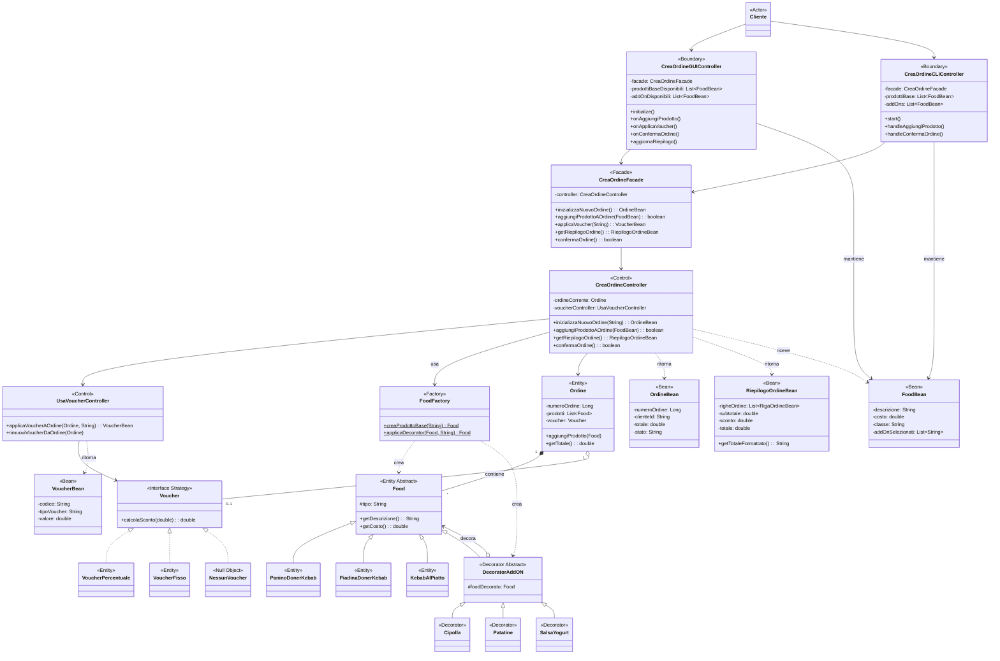

# VOPC - Use Case "Crea Ordine" (con FoodFactory)

## Diagramma Mermaid

---

## Legenda

| Stereotipo | Colore consigliato | Descrizione |
|------------|-------------------|-------------|
| `<<Actor>>` | Giallo | Utente del sistema |
| `<<Boundary>>` | Blu | View/Controller Grafico |
| `<<Facade>>` | Viola | Punto di ingresso per la View |
| `<<Control>>` | Verde | Controller Applicativo |
| `<<Factory>>` | Arancione chiaro | **NUOVO** - Crea Entity |
| `<<Bean>>` | Rosa | DTO per comunicazione |
| `<<Entity>>` | Arancione | Oggetti di dominio |
| `<<Decorator>>` | Arancione | Pattern Decorator |
| `<<Strategy>>` | Arancione | Pattern Strategy |

---

## Miglioramento GRASP ottenuto

| Principio | Prima | Dopo |
|-----------|-------|------|
| **Low Coupling** | Controller dipendeva da 7 classi Food | Controller dipende solo da FoodFactory |
| **Creator** | Controller creava Food | Factory crea Food |
| **Information Expert** | Controller "sapeva" come costruire | Factory "sa" come costruire |

Copia il codice Mermaid su [mermaid.live](https://mermaid.live) per visualizzarlo!
